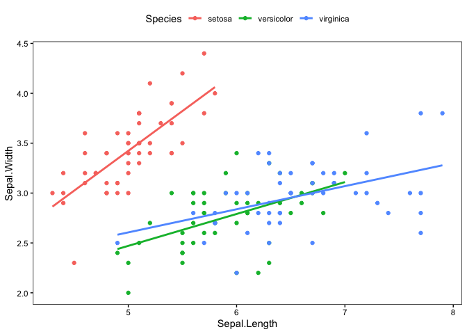
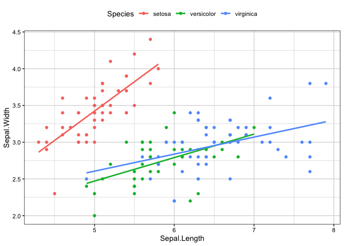
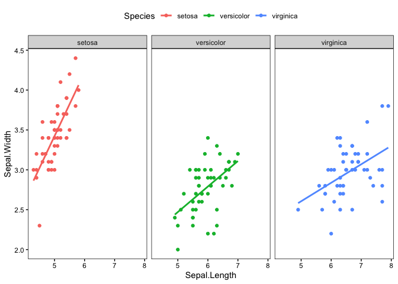
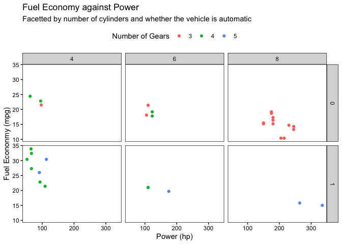

Personal ggplot themes
================

The themes work using the ggplot2 theme function.

``` r
library(ggplot2)
```

They are loaded as additional functions to the environment.

``` r
source("theme_mkw.R")
```

They can also be loaded directly from github using the line:

```r
source("https://raw.githubusercontent.com/mattkwyatt/ggplot_themes/master/theme_mkw.R")
```

## Simple theme

Theme is named `theme_mkw()` after the creator. All elements are black
or white except for grid lines. The legend is placed at the top of the
plot by default.

``` r
iris |> 
  ggplot(aes(x = Sepal.Length, y = Sepal.Width, col = Species)) +
  geom_point() +
  geom_smooth(method = "lm", se = FALSE) +
  theme_mkw()
```

<!-- -->

### With grid lines

Grid lines can be enabled using the `grid = TRUE` parameter.

``` r
iris |> 
  ggplot(aes(x = Sepal.Length, y = Sepal.Width, col = Species)) +
  geom_point() +
  geom_smooth(method = "lm", se = FALSE) +
  theme_mkw(grid = TRUE)
```

<!-- -->

### Facetted plots

The title boxes at the top of facets have a grey fill to make it clear
which plot they refer to.

``` r
iris |> 
  ggplot(aes(x = Sepal.Length, y = Sepal.Width, col = Species)) +
  geom_point() +
  geom_smooth(method = "lm", se = FALSE) +
  facet_grid(~Species) +
  theme_mkw()
```

<!-- -->

``` r
mtcars |> 
  ggplot(aes(x = hp, y = mpg, col = factor(gear))) +
  geom_point() +
  facet_grid(am ~ cyl) +
  labs(title = "Fuel Economy against Power",
       subtitle = "Facetted by number of cylinders and whether the vehicle is automatic",
       x = "Power (hp)", y = "Fuel Econonmy (mpg)", col = "Number of Gears") +
  theme_mkw()
```

<!-- -->
