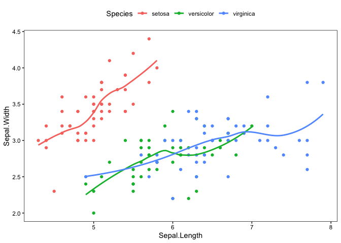
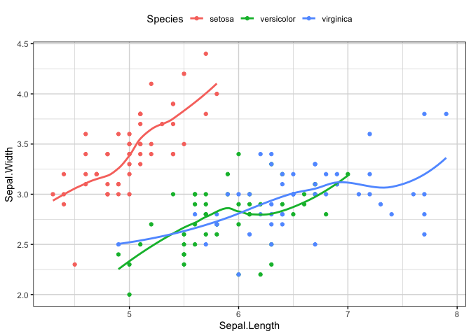

Personal ggplot themes
================

``` r
library(ggplot2)
```

``` r
source("theme_mkw.R")
source("theme_mkw_grid.R")
```

``` r
iris |> 
  ggplot(aes(x = Sepal.Length, y = Sepal.Width, col = Species)) +
  geom_point() +
  geom_smooth(se = FALSE) +
  theme_mkw()
```

    ## `geom_smooth()` using method = 'loess' and formula 'y ~ x'

<!-- -->

``` r
iris |> 
  ggplot(aes(x = Sepal.Length, y = Sepal.Width, col = Species)) +
  geom_point() +
  geom_smooth(se = FALSE) +
  theme_mkw_grid()
```

    ## `geom_smooth()` using method = 'loess' and formula 'y ~ x'

<!-- -->
